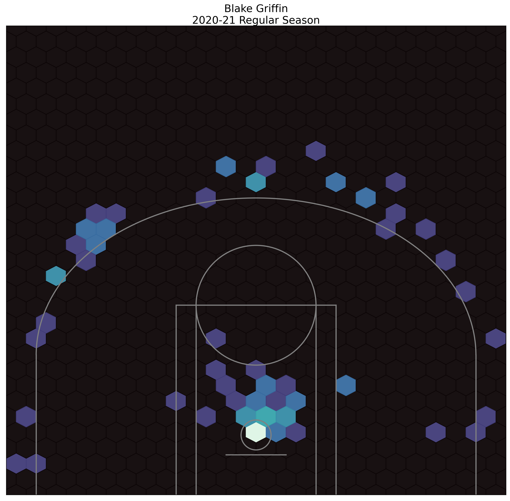
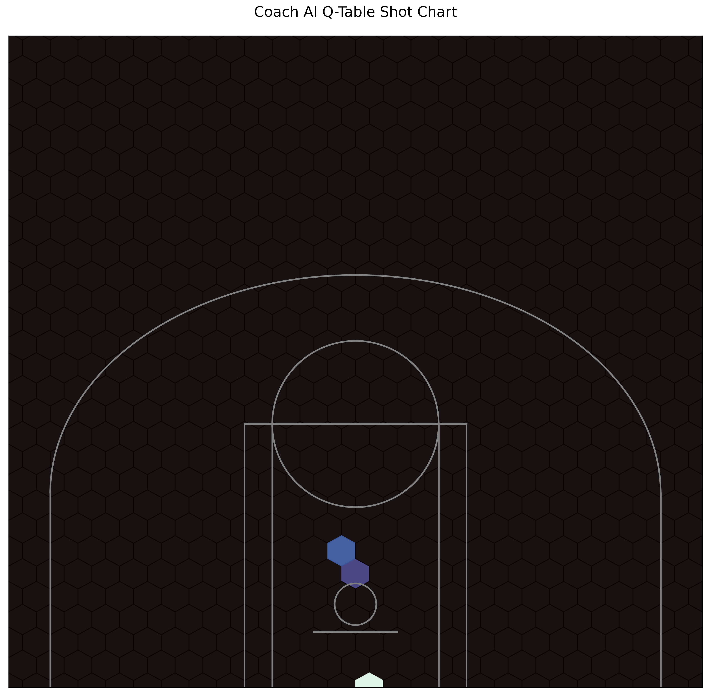

#  Capstone Project

# Coach AI
### Revising strategies in the NBA for a positionless game

 ## Contents:
 
- [Problem Statement](#Problem-Statement)  
- [Data](#Data)
- [Outside Research](#Research)
- [Data Gathering](#Data-Gathering)
- [Sentiment Scoring & EDA](#Data-Analysis-&-EDA)
- [Data Modelling](#Data-Modelling)
- [Conclusions and Recommendations](#Conclusions-and-Recommendations)

## Background:
The five traditional positions on the basketball court are the Point Guard (PG), Shooting Guard (SG), Small Forward (SF), Power Forward (PF), and Center (C).

Players knew the roles of their positions and stuck to them.

After bringing in data science and analytics, coaching stragies have changed. Players that previously would play in the mid-range are now shooting primarily shots close to the basket or three-pointers.

## Problem Statement:

My first task is to use unsupervised models to recluster players based on their current style of play, rather than their traditionally defined positions.

I then begin to explore whether or not coaching strategies are optimal by building using reinforcement learning and building a simplified basketball environment for AI agents to discover strategies.

In order to do so I will focus on a halfcourt game, 2 versus 2, and use probabilities to determine the success of an action. For example, whether or not a player makes a shot attempt will be determined by sampling from that player's shooting percentage distribution.

## Data

In order to cluster players and tie in player data from the current 2020-21 NBA season, I used the NBA API.

* [boxscore_scoring](./data/boxscore_scoring.csv): Original scraped scoring boxscore data using NBA API.
* [boxscore_traditional](./data/boxscore_traditional.csv): Original scraped scoring boxscore data using NBA API.
* [clustered_players](./data/clustered_players.csv): Combined data from boxscore_scoring, boxscore_traditional, and player_tracking datasets along with new cluster information.
* [play_by_play](./data/play_by_play.csv): Original scraped play-by-play data for every game to date in the current NBA Season.
* [player_tracking](./data/player_tracking.csv): Original scraped play-by-play data for every tracked game to date in the current NBA Season. The NBA does not publicly release tracking data for every game.
* [shot_distr](./data/shot_distr.csv): Created dataframe with alpha and beta values for players to use in creating the Basketball Environment.

## Outside Research:

NBA Stats: https://nba.com/stats
Basketball Reference: https://basketball-reference.com
NBA API: https://github.com/swar/nba_api

## Data Gathering:

I started by using the NBA API to scrape various NBA game data statistics for the current season.

I then combined dataframes and created custom features to use for clustering.

After dropping the nulls I also dropped rows with players that had less than 5 minutes of playing time, so that wouldn't be its own category.

I then took combined the data set and moved into clustering.

## KMeans Clustering

Originally I had planned to use DBSCAN to let the algorithm determine the new number of "positions" of player types. However, all the players were being clustered together. I then chose to use KMeans with 5 clusters, one per person on the court for each team:

Examples of players in cluster 4 include: Kevon Looney, Kenyon Martin Jr. and Onyeka Okongwu.

Examples of players in cluster 3 include: R.J. Hampton, Issac Bonga, and Quinn Cook.

Examples of players in cluster 2 include: Zion Williamson, Domantas Sabonis, and DeAndre Jordan.

Examples of players in cluster 1 include: De'Aaron Fox, LeBron James, and Chris Paul.

Examples of players in cluster 0 include: Buddy Hield, Duncan Robinson, and Kelly Oubre Jr.

I then focused more on EDA:

## EDA

I used a sample of players to show that for a majority of the NBA roster, when looking at shot selection through the lens of expected return per shot, it only makes sense to shoot the ball either next to the basket or for 3 points.

One example of a player that has played in both eras and has updated his style is Blake Griffin:

In the 2015-16 season, Griffin shot the ball either close to the basket or from midrange.

In the current 2020-21 season, Griffin is shooting the ball either close to the basket or from three point range and hardly anything in between.

## Shot Distributions

I then established prior distributions for shooting percentages and iterated through each game to update and create posterior distributions for player shooting percentages.

I focused on two up and coming teams and their young star players, Julius Randle and JR Barrett from the New York Knicks and Luka Doncic and Kristaps Porzingis from the Dallas Mavericks.

I created the shot_distr.csv file and took that information into creating the basketball environment for reinforcement learning.

## Environment, Player and Agent Modelling

In the Player class I brought in the shot distributions and created attributes such as whether or not a player has the ball or is defended.

I also created the Environment class that established the court and the rules, actions that an agent can take, and rewards for the actions.

#### Baseline

I ran agents that took random actions in order to establish that the model was functioning and to test to see that the environment and its rules weren't too easy or too difficult to solve.

#### Q-Learning

After establishing the random agent model as the baseline I then ran a Q-Learning model for the agents to learn the best policy. After running 250,000 trials the following shot chart was produced from the q-table.

The AI learned to shoot the ball close to the basket.

## Conclusions and Recommendations

I would like to expand the epsilon exploration hyperparameter in order to see if the AI would take a wider variety of shot attempts.

The ideal would be to expand the number of players to 5 vs. 5 in order to reflect actual basketball scenarios and run different in-game situations such as inbounding plays and end of game scenarios.